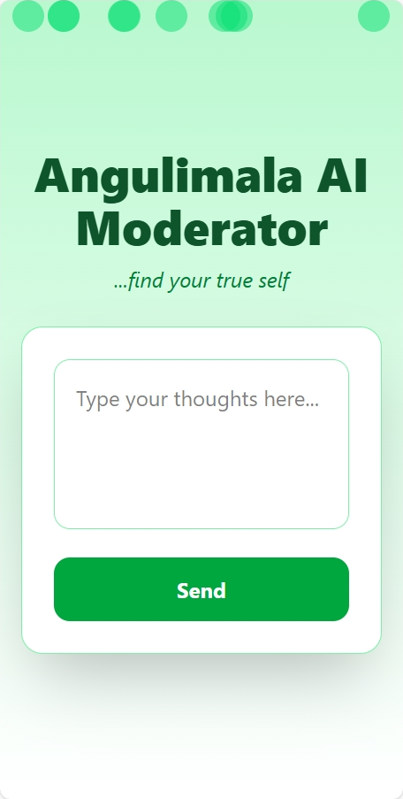
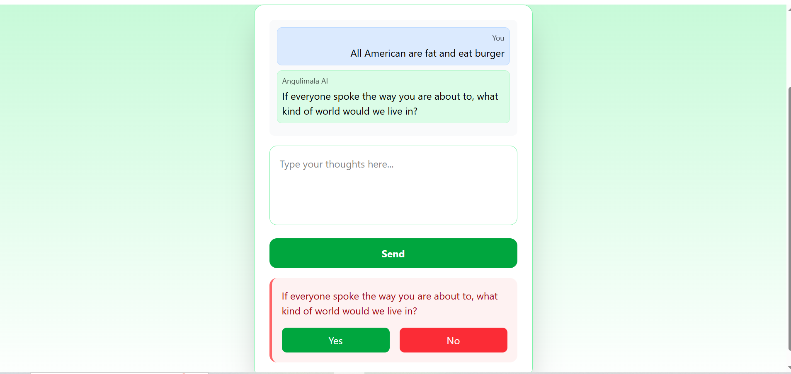
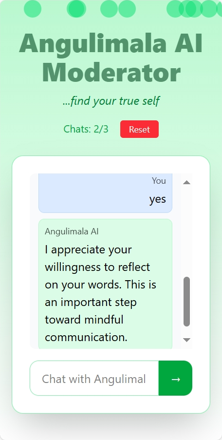
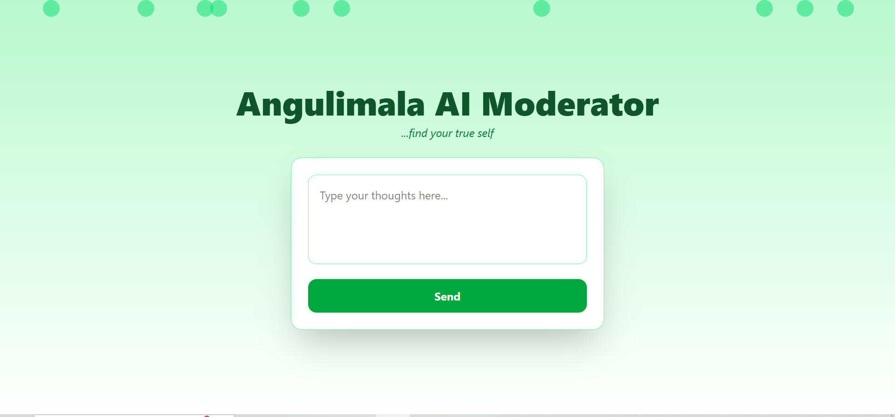

# Angulimala AI Moderator 🕊️

**Our motive is to make a healthy virtual world.**  
Angulimala AI Moderator is a web application and Chrome extension designed to detect and mitigate **hate speech** and **toxic online content**, empowering users to reflect on their words before posting and encouraging positive digital interactions.

---

## 📖 Background  

Hate speech and abusive content on social media have been rising worldwide (2021–2025).  
Victims and bystanders often face **depression, anxiety, social fear, and polarization**.  
Inspired by the Buddhist tale of **Angulimala’s transformation**, this project aims to **reduce negativity online and help users rethink toxic behavior**.  

🪷 The Story Behind Angulimala

In ancient India, Angulimala was feared as a ruthless bandit who wore a necklace of fingers taken from his victims.
One day, as he pursued his next target, he encountered the Buddha. Despite Angulimala’s threats, the Buddha remained calm and compassionate.

Through their conversation, Angulimala realized the futility of hatred and violence.
He renounced his past, transformed his life, and became a devoted monk who spread peace and kindness instead of fear.
---

## ✨ Features  

- 🌐 **Web application + Chrome extension** for real-time moderation.  
- 🤖 **AI-powered hate speech detection** (HuggingFace, Meta Hate Detection).  
- 💬 **Chatbot for self-reflection**, prompting users to rethink harmful posts.  
- 🌱 **Positive environment design** — UI/UX inspired by mindfulness and ethics.  
- 📊 **Vector database (Chroma)** for fast and scalable content moderation.  

---

## 🛠️ Tech Stack  

**Frontend:** React  
**Backend:** Django + Django REST Framework  
**LLM APIs:** HuggingFace, Meta Hate Detection  
**Database:** Chroma Vector DB  

---

## ⚙️ How It Works  

1. User writes/post text.  
2. Chrome extension analyzes content in real time.  
3. If flagged as **hate speech**, the system prompts reflection and alternatives.  
4. Web app provides deeper insights, moderation logs, and psychological tools for positivity.  

---

## 🖼️ Screenshots  

| Mockup | Mobile View |
|--------|-------------|
|  |  |

| Dashboard / Analysis | Add Post |
|-----------------------|----------|
|  |  |

| Chatbot Interaction |
|---------------------|
|  |

---

## 🎥 Video & 📄 PDF Resources

- 📹 **Demo Video:** [WhatsApp Video 2025-08-30 at 07.22.08](ScreenShot/video/WhatsApp%20Video%202025-08-30%20at%2007.22.08.mp4)  
- 📄 **Project PDF:** [ANGULIMALA PDF](ScreenShot/pdf/ANGULIMALA%20PDF.pdf)  

---

## 🏗️ Architecture  

*(Architecture diagram inside repo screenshots if available — replace placeholder when added)*  
  

---

## 🌍 Impact & Relevance to UNESCO  

- **Media and Information Literacy (MIL):** Helps users critically evaluate online information.  
- **Reducing hate speech:** Aims to regulate toxic speech at scale.  
- **Sustainability:** Planned integration with major social media platforms.  
- **Future scope:**  
  - Partnership with psychologists for better moderation.  
  - Expanded UI/UX tailored to mental well-being.  
  - Deployment as a **semi-profitable agency** for social good.  

---

## 👥 Team  

- **[Sahil Dinkar Katurde](https://github.com/SahilKaturde)** — Lead Developer, UI/UX, Full Stack  
- **[Omkar Amit Pardeshi](https://github.com/Omkar96-18)** — Full Stack Developer  
- **[Shardul](https://github.com/Luther-cpp)** — API Handler  
- **[Khetaram Sutar](https://github.com/Ksuthar99)** — Frontend Developer  

---

## 🚀 Demo  

📽️ [YouTube Demo Link](#) *(https://www.youtube.com/watch?v=2nhq8GYAvEk&feature=youtu.be)*  

---

## 📩 Contact  

- Repository: [GitHub - Angulimala AI Moderator](https://github.com/SahilKaturde/Angulimala-AI-moderator-)  
- Email:  

---

## 📜 License  

This project is licensed under the MIT License — see the [LICENSE](LICENSE) file for details.  

---

